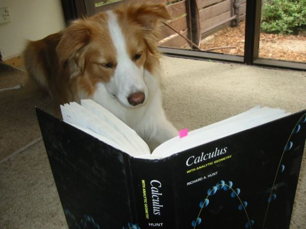
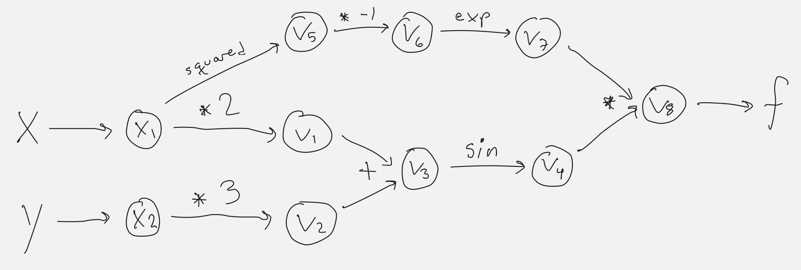

AutoDiff: Calculus Software Library Documentation
==================================================

..
    Authors:  Peyton Benac, Max CemIvan Shu and Seeam Shahid Noor
    ^^^^^^^^^^^^^^^^
Introduction
============
In engineering, statistical modelling, and countless other scientific disciplines, derivatives are calculated to measure change in a dynamic system. It is crucial for professionals of all kinds who work with quantitative systems to have access to software that can calculate derivatives quickly, efficiently, and with a simple-to-use interface. That is why ``TensorFlow`` exists. Our software package, ``AutoDiff``, will try to do the same.

``AutoDiff`` performs automatic differentiation to machine precision, as well as improves computational costs. This documentation walks through some of the mathematics of automatic differentiation, as well as some basic information about the usage of our library.

Background
==========
Computing gradients the old-fashioned way (by hand) is certainly feasible for many mathematical functions that appear in many applications. A key step in almost every derivative is known as the chain rule, which applies whenever our function's inner structure is a composition of functions, e.g.,

:math:`\\f(x, y) = g(h(x, y))`

Here's an example of computing the gradients of the function 

:math:`\\f(x, y) = \sin(2x + 3y)e^{-x^2}`

The partial derivative $\partial f/\partial x$ can be calculated using the product rule and the chain rule:

:math:`\partial f/\partial x = \sin(2x + 3y)(-2x)e^{-x^2} + 2\cos(2x + 3y)e^{-x^2}`

The partial derivative $\partial f/\partial y$ only needs to be calculated using the chain rule, since a term only involving x is constant with respect to y:

:math:`\partial f/\partial y = 3\cos(2x + 3y)e^{-x^2}`

We can represent the function's individual operations in a graphical format:

By parsing the structure of the function :math:`\\f(x, y)` into its atomic building blocks, we can construct a trace table from which we can read the results of the chain rule at every step of the computation.

The fact that this process is **automatic** comes very much in handy when computing gradients of more complex functions, for example:

:math:`f(x,y) = 3sin(e^{6x - ln(4y^3 - 3x^2)} + 17\sqrt{y^5-tanh(x)})17(4x^{1/3}+29yln(x - y))^{7/19}`

Yeah, we would prefer not to do that by hand.

How to use package
==================

How to install
--------------

Create a directory called ``Auto-Diff``, and then open your command line prompt in that directory. 

* ``https://github.com/git-fetch-git-roll-over/cs107-FinalProject.git`` to download the package
* ``virtualenv autodiff`` to create a virtual environment
* ``source autodiff/bin/activate`` to activate the environemnt
* ``pip install -r requirements.txt`` to install the necessary dependencies

Basic Demo
----------

Say there is a simple function and we want to get the derivative at :math:`x=4`:

:math:`f(x) = sin(x) + cos(x)`

First, from the module ``AutoDiff`` import class ``Variable`` and function ``Function``::

    from AutoDiff import Variable, Function

Then create an instance of Variable class and construct your elementary functions :math:`sin(x), cos(x)`::
    
   x1 = Variable('x', 3)
   f1 = Function.sin(x1)
   f2 = Function.cos(x1)

Last create a variable f to add of your f1 and f2 and print out f::

    f = f + f2 
    print(f)
    >>> sinx+cosx: value of -1.4104461161715403; derivative of 0.10315887444431626

Both the values and the derivative values are wrapped up in attributes belonging to these objects. For example:

    val(f1)
    >>> 0.1411200080598672
    val(f2)
    >>> -0.9899924966004454
    der(f1) 
    >>> -0.9899924966004454
    der(f2)
    >>> -0.1411200080598672
    der(f)
    >>> 0.10315887444431626

Software organization
=====================

Directory Structure
-------------------

With our main directory ``cs107-FinalProject``, We plan to organize our package as follows:

* dependencies in ``requirements.txt``
* continuous integration information in ``.travis.yml`` and coverage information in ``codecov.yml``
* documentation in ``\docs``
* test suite in ``\tests``
* code in ``\forward_mode``
* images in ``\images``

Basic Modules
-------------

We plan to include two modules: ``variable``, which defines the variable object and the differentiation rules that govern its behavior, and ``function`` which defines the elementary functions (e.g. sine, cosine, logarithms). 

How to Test
------------

Both ``TravisCI`` and ``CodeCov`` are used and our test suite will live inside our repo in a ``\tests`` directory. Our project currently has 79% coverage.

How to Install
--------------

As of now, we primarily distribute our code by having clients clone our github repository, but we hope to also make it pip-installable. For the future, we plan to package our project using `wheels <https://www.python.org/dev/peps/pep-0427/>`_. This should make it easily pip installable.

Implementation Details
======================

Descriptions
------------

Our implementation isn't currently built on any singular data structure, but as we expand to account for multiple inputs we plan to use numpy arrays. This will make it easy to perform operations on either single values or single or multidimensional arrays. 

The main class of this package is the ``Variable`` class and it creates instances of single input variables. The class contains attributes such as *name*, *value* and default *derivative*. 
 
This module also contais a ``Function`` method that can create instances of the elementary functions (e.g. :math:`sin, cos, tan, exp` and :math:`log`), evaluated at an instance of the ``Variable`` class with both a derivative and value. If the elementary function is :math:`exp` or :math:`log`, the default base value is   :math:`e`.

Future Direction
----------------

We are planning to extend our basic automatic differentation package to handle cases where involves multi-dimensional inputs and outputs. We are also interested in implementing an extra feature either with dual numbers or optimization. 

.. toctree::
   :maxdepth: 2
   :caption: Contents:

    license
    help

..
    Indices and tables
    ==================

    * :ref:`genindex`
    * :ref:`modindex`
    * :ref:`search`
