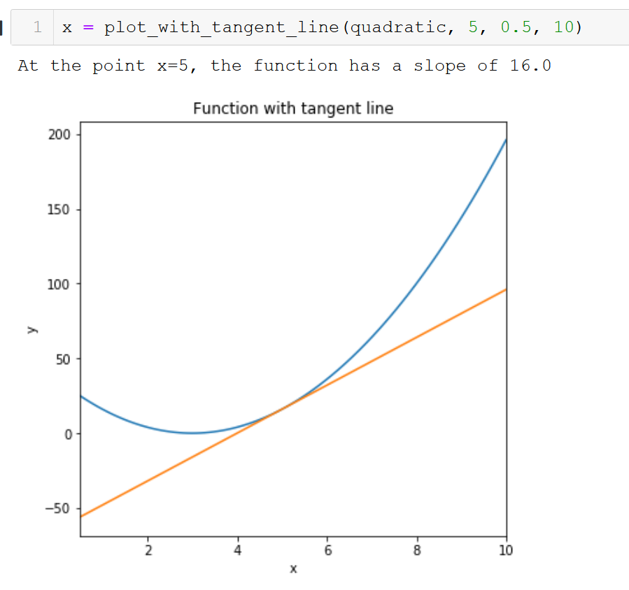

Tool Demos
===========

.. role:: raw-html(raw)
   :format: html
   
GradDog includes tools to allow users to easily perform common actions on scalar functions related to their first derivatives. These tools also provide a skeleton for users who desire to write their own tools using GradDog for differentiation. 

First, import the full ``graddog`` module (recommended alias: ``gd``), the functions from the ``functions`` module::

    import graddog as gd
    from graddog.functions import sin, cos, tan, exp, log
    
Then, create the function you would like to use (See `this link <http://introtopython.org/introducing_functions.html>`_ for more information on creating your own Python functions)::

    def quadratic(x):
         a=4
         xoffset = 3
         yoffset = 0
         return a*(x-xoffset)**2 + yoffset
        
All tools in the tools module also take in the lower and upper limits of the x-interval on which you'd like to evaluate the derivative. More detail on each of their inputs and outputs is provided below.

plot_derivative:
----------------

The ``plot_derivative`` tool plots the derivative of the provided function over a given interval. This is a numerical method and therefore includes an ``n_pts`` parameter that can be increased to improve resolution or decreased to improve speed. The default value is 100, which suffices for most simple plots.

Inputs:

* function[function]: the function of which you'd like to plot the derivative (must only take single input)
* xmin: lower bound on which to calculate derivative
* xmax: upper bound on which to calculate derivative
* n_pts [int](Default: 100): how many points to use when evaluating derivative (more = better resolution but slower)
* figsize [tuple](Default: (6,6)): figsize in inches (see matplotlib documentation)
* xlabel [string](Default: 'x'): Label for x axis of plot
* ylabel [string](Default: 'y'): Label for y axis of plot
* plotTitle [string](Default: 'Derivative'): Label for title of plot

Outputs:

* xs: the array of linearly spaced x values between xmin and xmax
* ys: the derivative evaluated at the values in xs
 
Example:: 

    xs, ys = plot_derivative(quadratic, 0, 5)
    

find_extrema_first_order:
------------------------------

The ``find_extrema_first_order`` tool locates the point where the derivative is closest to zero on the given interval.

Inputs:

* function[function]: the function of which you'd like to plot the derivative. (one scalar input)
* xmin: lower bound on which to calculate derivative
* xmax: upper bound on which to calculate derivative
* n_pts [int](Default: 100): how many points to use when evaluating derivative (more = better resolution but slower)
* tolerance [float](Default: 1e-10): how close to zero should a value be before it's considered an extrema?

Outputs:
If it can locate your extrema exactly, it will return only the x value(s) of the extrema.
If not it will return:

* xs: a tuple containing the two x values between which the extrema is located

To locate the extrema on the interval (-10,10) for the quadratic function defined above
Example::

    x_extr = find_extrema_firstorder(quadratic, -10, 10)

In this case, the function fails to find the precise extrema, but instead returns a tuple of x values that the extrema is between. 

Example::

    def fun(x):
         return 3*x**4 - 6*x**3       
    xs_EX = find_extrema_firstorder(fun, -2, 4)
    
In this case, the function finds the exact extrema, so it returns only that value. 
If there is more than one point in the given interval that is lower than the tolerance value, it will return xvalues for all points.

find_increasing
----------------

The ``find_increasing`` tool locates the region on a given interval where the function is increasing.

Inputs:

* function[function]: the function that you want to locate increasing regions on  (one scalar input)
* xmin: lower bound of interval
* xmax: upper bound of interval
* n_pts (default = 100): how many points to use when evaluating derivative (more = better resolution but slower)

Outputs:

* xs: the x values where the function is increasing
* ys: the y values where the function is increasing

To locate the increasing region on the interval (-5,5) for the quadratic function defined above
Example::
    xinc, yinc = find_increasing(quadratic, -5, 5)

find_decreasing:
------------------

The ``find_decreasing`` tool locates the region on a given interval where the function is decreasing.

Inputs:

* function[function]: the function that you want to locate decreasing regions on  (one scalar input)
* xmin: lower bound of interval
* xmax: upper bound of interval
* n_pts (default = 100): how many points to use when evaluating derivative (more = better resolution but slower)

Outputs:

* xs: the x values where the function is decreasing
* ys: the y values where the function is decreasing

To locate the decreasing region on the interval (-5,5) for the quadratic function defined above
Example::

    xdec, ydec = find_decreasing(quadratic, -5, 5)
    
plot_with_tangent_line:
-----------------------
The ``plot_with_tangent_line`` tool plots the provided function with a tangent line at a specified point.

Inputs:

* function[function]: the function you'd like to plot.
* xtangent: value at which you want the tangent line to intersect the function
* xmin: lower bound on which to plot
* xmax: upper bound on which to plot
* n_pts [int](Default: 100): how many points to use when plotting function (more = better resolution but slower)
* figsize [tuple](Default: (6,6)): figsize in inches (see matplotlib documentation)
* xlabel [string](Default: 'x'): Label for x axis of plot
* ylabel [string](Default: 'y'): Label for y axis of plot
* plotTitle [string](Default: 'Derivative'): Label for title of plot

Outputs: 

* xs: the array of linearly spaced x values between xmin and xmax
* ys: the derivative evaluated at the values in xs

To plot a function and its tangent line at x=1 on the interval (-2,2)::

    def f(x):
        return 4*x**3 - 5*x     
    xs, ys = plot_with_tangent_line(f, 1, -2, 2)
    

